# MASS-TNGD-PILOT-001 Implementation Backlog

## Document Control

| Field | Value |
|---|---|
| Document ID | MASS-TNGD-PILOT-001-BACKLOG |
| Title | TNGD Dispatch User Portal — Itemized Implementation Backlog |
| Version | 1.0 |
| Status | Planning Baseline — Awaiting Architectural Review and Work-Order Authorization |
| Source | [MASS-TNGD-PILOT-001 Operational Pilot Charter](MASS-TNGD-PILOT-001_TNGD_Dispatch_User_Portal_Operational_Pilot_Charter.md) |
| Roadmap Authority | [MASS-PLAN-001](../../../governance/MASS-PLAN-001_Master_Product_Roadmap.md) |
| Created | 2026-08-04 |

## 1. Purpose and Authority Boundary

This backlog translates the approved pilot charter into build-package candidates. It preserves the charter as the governing product brief and identifies the evidence required to prove one complete TNGD operating loop.

This backlog does not authorize manufacturing. Each package must receive an approved Engineering Work Order and enter the canonical production inbox before implementation begins. Existing MASS applications, engines, contracts, and ownership boundaries must be consumed rather than duplicated.

## 2. Pilot Production Sequence

| Order | Package ID | Build Package | Charter Sections | Primary MASS Ownership | Depends On |
|---:|---|---|---|---|---|
| 1 | TNGD-BP-001 | Secure Access, Roles, and Portal Separation | 2, 5, 14, 26, 29–30 | APP-002, APP-022, APP-023, APP-024; ENG-003–004 | Existing identity and security contracts |
| 2 | TNGD-BP-002 | Three-Path Guided Intake | 4, 6, 8–9, 27, 29 | APP-009, APP-012, APP-024 | BP-001 |
| 3 | TNGD-BP-003 | Eight-Question Intake Record | 7–9, 29 | APP-004, APP-012, APP-013, APP-014 | BP-001–002 |
| 4 | TNGD-BP-004 | Customer Record and Relationship Timeline | 9–10, 22–23, 27 | APP-003, APP-004, APP-012 | BP-001–003 |
| 5 | TNGD-BP-005 | Scheduling and Calendar Synchronization | 11, 29 | APP-005, APP-020; ENG-016 | BP-001, BP-004 |
| 6 | TNGD-BP-006 | Dispatch Board and Technician Handoff | 12–13, 27, 29 | APP-009, APP-012, APP-023; ENG-006, ENG-010 | BP-004–005 |
| 7 | TNGD-BP-007 | Mobile Technician Workflow | 14–16, 27, 29 | APP-012, APP-023 | BP-001, BP-006 |
| 8 | TNGD-BP-008 | Repair and Estimate Execution | 17–18, 27, 29 | APP-010, APP-012 | BP-003–007 |
| 9 | TNGD-BP-009 | Customer Authorization Evidence | 19, 27, 29 | APP-007, APP-010, APP-012, APP-022 | BP-008 |
| 10 | TNGD-BP-010 | Invoice and Square Payment Integration | 20, 27, 29 | APP-010, APP-020, APP-024; ENG-016 | BP-009 |
| 11 | TNGD-BP-011 | Administrative Reconciliation and Exceptions | 21, 27, 29 | APP-009, APP-010, APP-012 | BP-006–010 |
| 12 | TNGD-BP-012 | Warranty Stewardship | 23, 27, 29 | APP-003, APP-004, APP-012 | BP-004, BP-008, BP-011 |
| 13 | TNGD-BP-013 | Customer Follow-Up and Relationship Flywheel | 22, 27, 29 | APP-003, APP-006, APP-012, APP-018 | BP-004, BP-010–012 |
| 14 | TNGD-BP-014 | Operational Reporting and Owner Visibility | 24–25, 29 | APP-001, APP-014, APP-019 | BP-002–013 |
| 15 | TNGD-BP-015 | Soft-Launch Verification, Migration, and Rollback | 28–32, 34–35 | APP-021, APP-022; engineering governance | BP-001–014 |

## 3. Build-Package Definitions

### TNGD-BP-001 — Secure Access, Roles, and Portal Separation

- Purpose: Establish authenticated internal access, least-privilege roles, tenant isolation, and separation from the public website.
- Outputs: role matrix; authorization boundaries; session controls; audit events; public-intake API boundary; password recovery; restricted technician access.
- Evidence: cross-role and tenant-isolation tests; unauthorized public-action rejection; audit-history verification.

### TNGD-BP-002 — Three-Path Guided Intake

- Purpose: Provide Repair, Estimate, and configurable Other Service entry paths without exposing internal complexity.
- Outputs: path configuration; conditional rules; intake lifecycle; source tracking; incomplete-intake queue; urgency-review indicators.
- Evidence: each path creates a governed intake record; emergency indicators remain advisory; public and staff submissions enter the same processing boundary.

### TNGD-BP-003 — Eight-Question Intake Record

- Purpose: Implement the complete intake standard with conditional detail, attachments, and confirmation.
- Outputs: eight question groups; validation; duplicate suggestions; photo references; voice-note or approved alternative; structured summary.
- Evidence: no path exceeds eight primary questions; missing data is visible; users confirm AI-assisted summaries.

### TNGD-BP-004 — Customer Record and Relationship Timeline

- Purpose: Preserve identity, locations, service history, consent, financial references, warranties, and follow-up as a continuing relationship.
- Outputs: customer and location contracts; duplicate resolution; consent restrictions; timeline events; source ownership map.
- Evidence: completed jobs remain discoverable; duplicate handling preserves history; communications honor consent.

### TNGD-BP-005 — Scheduling and Calendar Synchronization

- Purpose: Coordinate appointments and technician availability while MASS remains authoritative.
- Outputs: appointment lifecycle; availability and duration rules; assignment; reschedule/cancel paths; Google Calendar gateway; synchronization failures.
- Evidence: conflicts are visible; calendar data is minimized; synchronization failures do not erase MASS appointments.

### TNGD-BP-006 — Dispatch Board and Technician Handoff

- Purpose: Present operational queues and deliver governed job context to assigned technicians.
- Outputs: New, Scheduled, Attention Needed, and Follow-Up queues; assignment; handoff; ETA/status updates; exception escalation.
- Evidence: unassigned and delayed work is visible; technician updates return to administration; duplicate entry is unnecessary.

### TNGD-BP-007 — Mobile Technician Workflow

- Purpose: Support field work through concise, mobile-first actions and evidence capture.
- Outputs: today/current/next views; governed statuses; inspection checklist; photos; measurements; voice notes; completion evidence.
- Evidence: technicians see only authorized records; required evidence blocks incomplete submission; administrative data remains restricted.

### TNGD-BP-008 — Repair and Estimate Execution

- Purpose: Govern diagnosis, recommendations, estimates, performed work, declined work, and accepted-estimate conversion.
- Outputs: repair and estimate records; options and line items; measurements; product details; conversion and follow-up states.
- Evidence: recommended, authorized, completed, declined, and deferred remain distinct; accepted estimates reuse existing records.

### TNGD-BP-009 — Customer Authorization Evidence

- Purpose: Capture immutable evidence that an authorized customer approved defined scope, price, terms, and disclosures.
- Outputs: authorization record; acknowledgment; signature or approved equivalent; technician identity; amendment process.
- Evidence: employees and AI cannot self-authorize; changes create new evidence rather than mutating approval.

### TNGD-BP-010 — Invoice and Square Payment Integration

- Purpose: Maintain financial state in MASS while delegating payment processing to Square.
- Outputs: invoice summary; line items; taxes, discounts, deposits and balance; Square gateway; payment, receipt, refund, and portal references.
- Evidence: prohibited card data is never stored; webhooks are idempotent; customer access is transaction-scoped.

### TNGD-BP-011 — Administrative Reconciliation and Exceptions

- Purpose: Return completed field work to administration for verification, reconciliation, follow-up, and exception handling.
- Outputs: completion-review queue; evidence checklist; outcome states; callback, parts, payment, warranty, estimate, and escalation exceptions.
- Evidence: administration handles exceptions without reconstructing jobs; unresolved work cannot silently close.

### TNGD-BP-012 — Warranty Stewardship

- Purpose: Preserve warranty eligibility, source-job lineage, claim intake, findings, coverage, and resolution.
- Outputs: warranty record; eligibility rules; source references; warranty appointment; covered/non-covered distinction; history.
- Evidence: warranty concerns enter guided intake; disposition remains traceable to evidence.

### TNGD-BP-013 — Customer Follow-Up and Relationship Flywheel

- Purpose: Convert completed service into governed satisfaction, review, estimate, maintenance, and relationship activity.
- Outputs: immediate, short-term, two-month, six-month, and annual rules; eligibility; consent checks; task and communication handoffs.
- Evidence: opt-outs suppress communication; follow-up survives job closure; Communications governs every delivery.

### TNGD-BP-014 — Operational Reporting and Owner Visibility

- Purpose: Provide minimum trustworthy operating visibility for pilot oversight.
- Outputs: charter KPI definitions; lineage; exception and outstanding-work views; workload; revenue and payment summaries; export controls.
- Evidence: metrics trace to authoritative records; AI summaries remain advisory; advanced prediction is not a launch dependency.

### TNGD-BP-015 — Soft-Launch Verification, Migration, and Rollback

- Purpose: Prove the complete loop, prepare pilot users, and preserve a controlled return path.
- Outputs: end-to-end test plan; security tests; backup/restore evidence; transition plan; old-CRM reference period; rollback runbook; readiness checklist.
- Evidence: every launch gate has named evidence; staff complete primary workflows without developer help; rollback is tested before launch.

## 4. Cross-Package Manufacturing Standard

Every authorized pilot work order shall identify:

- Permanent MASS ownership and TNGD-specific configuration.
- Platform services and applications consumed.
- Responsibilities owned and delegated.
- Events published and consumed.
- Public, internal, technician, customer, and executive trust boundaries.
- Tenant, role, and human-approval enforcement.
- Source-of-truth and integration-failure behavior.
- Migration, audit, observability, backup, and rollback requirements.
- Permanent Architecture versus V1 implementation.
- Acceptance evidence tied to the charter’s launch gates.

## 5. Pilot Critical Path

```mermaid
flowchart LR
    A["BP-001 Secure Access"] --> B["BP-002 Guided Intake"]
    B --> C["BP-003 Eight Questions"]
    C --> D["BP-004 Customer Record"]
    D --> E["BP-005 Scheduling"]
    E --> F["BP-006 Dispatch"]
    F --> G["BP-007 Technician Workflow"]
    G --> H["BP-008 Repair and Estimate"]
    H --> I["BP-009 Authorization"]
    I --> J["BP-010 Invoice and Payment"]
    J --> K["BP-011 Reconciliation"]
    K --> L["BP-012 Warranty"]
    K --> M["BP-013 Follow-Up"]
    L --> M
    M --> N["BP-014 Reporting"]
    N --> O["BP-015 Launch and Rollback"]
```

Parallelization is permitted only where dependencies and source ownership remain intact. The first release must prove the complete loop rather than isolated feature completion.

## 6. Readiness and Completion Rules

A package is ready for a Work Order only when its dependencies, ownership map, TNGD configuration boundary, acceptance evidence, failure behavior, and security controls are reviewable.

A package is complete only when repository artifacts, executable behavior, tests, evidence, and operational documentation satisfy its authorized Work Order. Documentation alone does not complete a package.

## 7. Review State

- Codex translation: Complete.
- Architectural fit review: Pending Claude review.
- Security-separation review: Pending Claude review.
- Pilot-completeness review: Pending Claude review.
- Launch-gate sufficiency review: Pending Claude review.
- Manufacturing authority: Not yet issued.
